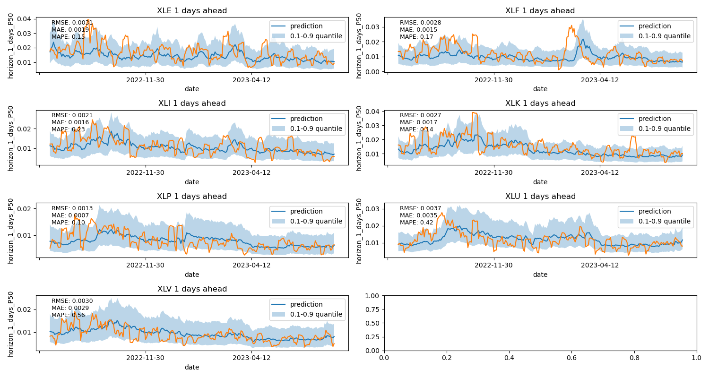

# 1. Overview

In this project, I use Temporal Fusion Transformer (TFT) to forecast 10-day volatility of 7 sector-specific ETFs:

 - XLK - Technology
 - XLP - Consumer Staples
 - XLF - Financial
 - XLV - Health Care
 - XLE - Energy
 - XLI - Industrial
 - XLU - Utilities

Given the limited availability of high-frequency data (e.g. 5-min data), I opted to forecast **5-day Historical Volatility** which is defined as the standard deviation of log of daily returns across 5 days. More concretely, given the inputs Xt-n to Xt, the model predicts Yt+1 to Yt+10. 

One of the key features of TFT architecture is the ability to output prediction *intervals*, by using Quantile Loss function. The model was trained to provide 3 quantile results - P10, P50, and P90. Another important feature of TFT is the ability to output multi-horizon forecast. For this project, the model was trained to predict 10-day ahead volatility.

The model can be accessed via an API deployed on AWS Elastic Beanstalk using the following [link](http://pytorch-final-env.eba-zbppsjpu.us-east-1.elasticbeanstalk.com/predict). Due to the size of the model and the necessary imports, the API is deployed on t2.medium instance.

 ## 2. Data Source

 All daily stock data was obtained from Yahoo Finance.

 ## 3. Training

Run [training](training/training.py) script to train the model. 
Bayesian optimization was conducted to select optimal hyperparameters for the model. Values for key hyperparameters can be found in the [config](training/config.py) 

## 4. Results

- 
-  
-  
-  

